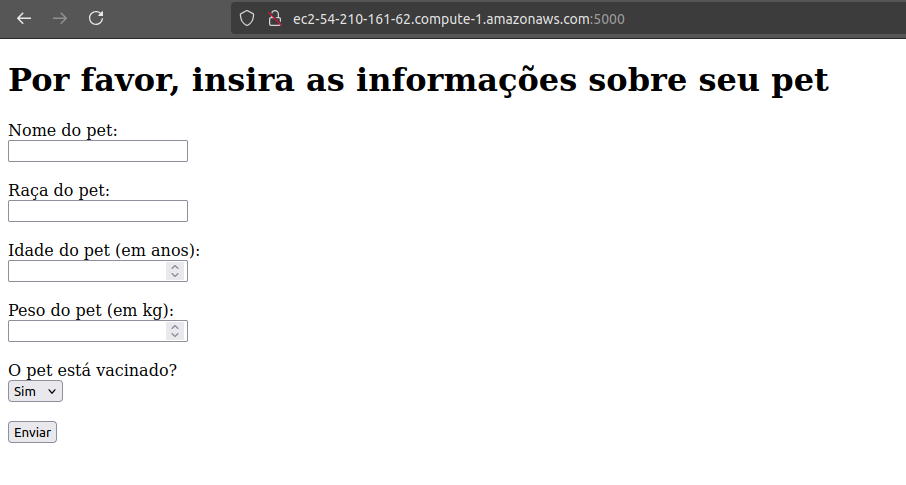

# Projeto Api Pet ADA

## Sumario

### Este projeto é uma aplicação em Python 3.11, com a função de treinar o desenvolvimento de uma pipeline para o deploy de quaisquer mudanças realizadas na branch "main", com um gatilho para atualizar uma instancia EC2 na nuvem AWS.

## Resultado final




## App rodando na AWS


## App rodando na CLI

### Caso queira, atraves de uma conexão SSH ou do Cloud Connect, em /home/ec2-user/app, rode o comando:

```bash
python3 pet_info.py
```
### Resultado


## Arquitetura da implantação


## Funcionalidades do app

- Adicionar novos pets com nome, raça, idade, peso e informação sobre vacinação.
- Visualizar a informação do pets cadastrado.

## Tecnologias utilizadas

- **Python**: Linguagem de programação utilizada para desenvolver a aplicação.
- **Flask**: Framework web utilizado para criar a aplicação.
- **Gunicorn**: Servidor HTTP WSGI para servir a aplicação.
- **AWS**: Nuvem utilizada para hospedar a aplicação.
- **Github Actions**: Ferramenta utilizada para criar a pipeline de deploy.

## Como utilizar

### Pré-requisitos

- Python 3.11
- Pip
- Virtualenv

### Instalação

1. Clone o repositório

```bash
git clone git@github.com:LuizCampedelli/Projeto_Api_Pet_ADA_Final.git
```

2. Crie um ambiente virtual

```bash
python3 -m venv myvenv
source myvenv/bin/activate
```


3. Instale as dependências

```bash
pip install -r requirements.txt
```


4. Execute a aplicação no CLI

```bash
python3 pet_info.py
```


5. Acesse a aplicação no navegador

```bash
gunicorn --bind 0.0.0.0:5000 app:app
```


6. Acesse a aplicação no navegador

```bash
http://localhost:5000
```


## Como contribuir

1. Siga as diretivas do [CONTRIBUTING.md](docs/CONTRIBUTING.md)

## Autores

- [Luiz Campedelli](https://github.com/LuizCampedelli)

---
