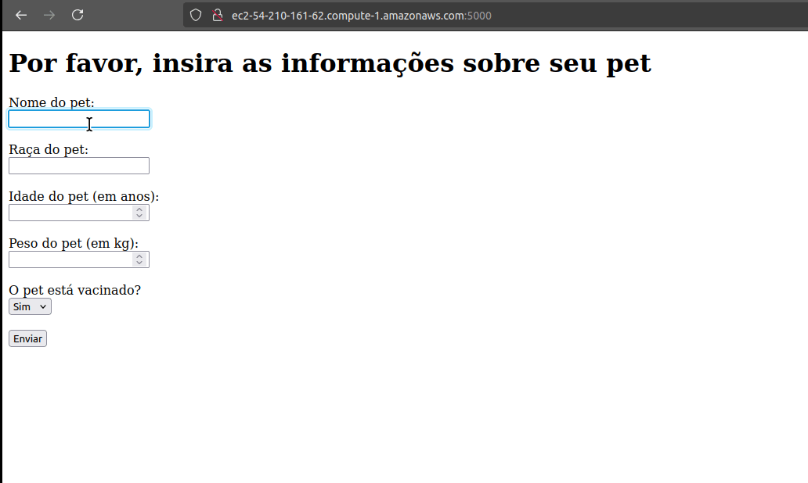

# ADA Pet API Project

## Summary

### This project is an application in Python 3.11, with the function of training the development of a pipeline for the deployment of any changes made in the "main" branch, with a trigger to update an EC2 instance in the AWS cloud.

## Final result


## App running on AWS



## App running on CLI

### If you want, through an SSH connection or Cloud Connect, in /home/ec2-user/app, run the command:

```bash
python3 pet_info.py
```
### Result


## Architecture of deployment


## App features

- Add new pets with name, breed, age, weight and vaccination information.
- View information about registered pets.

## Technologies used

- **Python**: Programming language used to develop the application.
- **Flask**: Web framework used to create the application.
- **Gunicorn**: WSGI HTTP server to serve the application.
- **AWS**: Cloud used to host the application.
- **Github Actions**: Tool used to create the deployment pipeline.

## How to use

### Prerequisites

- Python 3.11
- Pip
- Virtualenv

### Installation

1. Clone the repository

```bash
git clone git@github.com:LuizCampedelli/Projeto_Api_Pet_ADA_Final.git
```

2. Create a virtual environment

```bash
python3 -m venv myvenv
source myvenv/bin/activate
```

3. Install the dependencies

```bash
pip install -r requirements.txt
```

4. Run the application in the CLI

```bash
python3 pet_info.py
```

5. Access the application in the browser

```bash
gunicorn --bind 0.0.0.0:5000 app:app
```

6. Access the application in the browser

```bash
http://localhost:5000
```

## How to deploy to AWS using Github Actions

1. Create an AWS account and configure programmatic access.
2. Create an EC2, with an SSH key, download the key to a safe location.
3. Create a Security Group for the EC2, with ports 22 and 5000 open.
4. Add the secrets in the various actions secrets in the repository's Settings tab, with the following keys:
- AWS_ACCESS_KEY_ID
- AWS_SECRET_ACCESS_KEY
- AWS_REGION
- EC2_IP
- EC2_PRIVATE_KEY

5. Push to the "main" branch and watch the deployment pipeline run.

## Notes

- If you want to make changes without triggering the deploy, commit like this:

```bash
git commit -m 'feat/feature_name [skip actions]'
```

### The following types of commits are supported for skipping actions:

- [skip ci]
- [ci skip]
- [no ci]
- [skip actions]
- [actions skip]

### Example of a commit with skip actions:

```bash
git commit -m "Update docs [skip ci]"
git commit -m "Fix typo [ci skip]"
git commit -m "Minor change [no ci]"
git commit -m "Change config [skip actions]"
git commit -m "Update dependencies [actions skip]"
```

### Good practices

- If you don't want to send the README and docs files to the deploy, add them to your deploy:

```bash
on:
push:
branches:
- main
paths-ignore:
- 'docs/**'
- 'README.md'
```

## License

This project is licensed under the MIT License. See the [LICENSE](LICENSE) for more information.

## How to contribute

1. Follow the guidelines in [CONTRIBUTING.md](docs/CONTRIBUTING_EN.md)

## Authors

- [Luiz Campedelli](https://github.com/LuizCampedelli)

---
